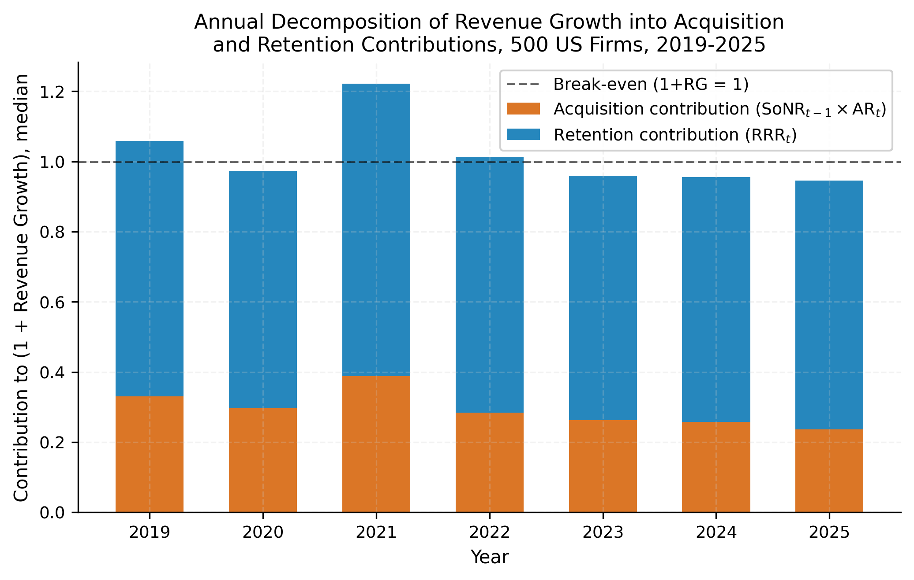

# How Do Firms Grow Their Revenue With Their Customers?

How much of a firm's revenue growth comes from **acquiring new customers**, and how much from **retaining existing ones**? This project derives an exact accounting identity linking the two: one plus revenue growth equals the prior-period share of new revenue times the acquisition rate, plus the revenue retention rate. It holds for every firm and period, with no free parameters.

**Data:** 500 U.S. firms, 2017-2025 (3,920 firm-year observations, 16 industries).

**Method:** the identity RG = SoNR × AR + RRR - 1 is applied to the panel, then five empirical regularities are documented: the marginal weight of retention vs. acquisition, standardized effect sizes, long-run convergence behavior, the acquisition/retention correlation, and a variance decomposition of each driver's persistence.

## Result

Retention consistently contributes more to revenue growth than acquisition across 2019-2025 (median split, break-even line at 1+RG = 1), consistent with the paper's headline finding that a one-standard-deviation increase in RRR raises revenue growth by 26.1 percentage points versus 13.6 for AR.

## Repository contents

- Core panel construction and analysis (`revenue_growth_main.py`)
- Paper figure generation (`generate_figures_v3.py`) and additional paper analyses/tables (`new_analyses_v3.py`, supersedes an earlier v2)
- Out-of-sample validation: forecasting comparison and Clark-West test (`validation_exercise.py`)
- `figures/` — the 16 figures currently cited in the paper (PDF + PNG)

## Data

The underlying firm-level revenue and financial statement data are proprietary/licensed and are not included in this repository. Code is provided for transparency and methodology review.
